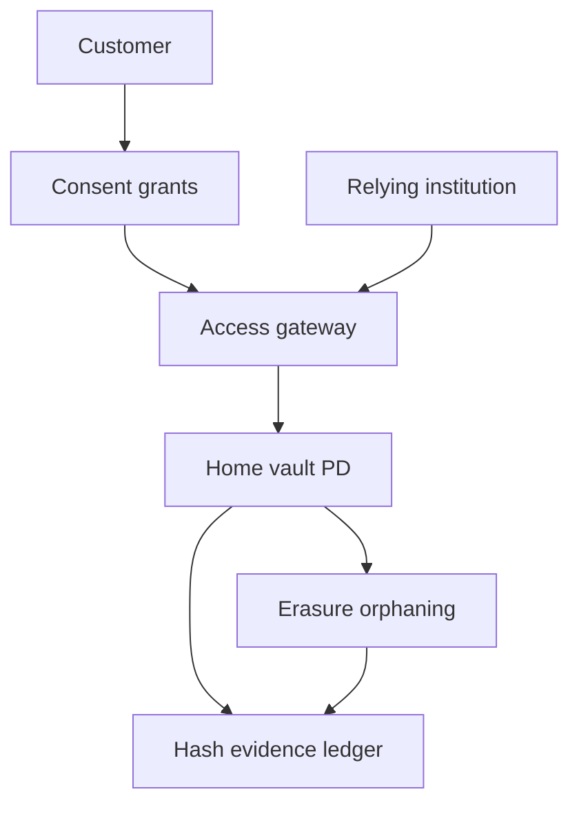

# Oncepass

**Source:** `ai-in-decentralized+ai/fiveconsiderationsforblockchainappliedtodataprivacygdpr-180525134814/`
**Domain:** `ai-decentralized`
**One-liner:** A consent-gated KYC evidence reuse network where a customer shares identity proofs once with their bank, then grants other institutions time-boxed access to verification evidence — without putting personal data on-chain.
**Wedge:** EU retail banks and regulated FIs joining permissioned identity networks who still re-collect KYC packs for every new product relationship — starting with bank-to-bank evidence reuse under customer consent.
**Positioning:** Privacy-network commercialisation of Consagous’s five GDPR/blockchain considerations. The deck’s “Promising First Steps” is the actionable wedge: share personal data once with your bank, then consent for the network to provide KYC evidence to another institution; Sovrin-style self-sovereign identity can operate even on public networks; right to erasure requires hashes/evidence on-chain rather than personal data. Oncepass is that reuse desk — distinct from Consentrail (broader IBM five-pillar GDPR ops), Aliaskeep (pseudonym link governance), and Forgetcase (Article 17 casework).

## Market research synthesis

### Thesis from source

The short Consagous brief argues citizens lack confidence that institutions secure and respect private data, while people continue trading privacy for likes and coupons and suffering breaches. GDPR and blockchain appear to start from opposite places (central regulation vs inflation-proof currency without central authority) yet share underlying principles of secured, individual-controlled data. Privacy cannot be solved by technology alone — culture, education, legal, business, process, and technology must combine — but blockchain networks already show value in food trust, shipping, trade finance, and payments.

Five considerations structure the brief: (I) technology and regulation together; (II) opposite starting points, same principles; (III) promising first steps — KYC evidence reuse under consent; (IV) privacy in public networks via Sovrin self-sovereign identity (privacy ≠ only private/permissioned chains); (V) right to erasure — no personal data directly on-chain; use cryptographic hashes/evidence instead. Oncepass takes consideration III as the product wedge and hard-wires V as an architectural constraint, with IV as an optional SSI credential mode.

### Buyer & economic model

- **Primary buyer:** Head of KYC / Digital Identity at a retail bank or regulated FI facing repeated onboarding cost and GDPR friction.
- **Users:** customers (consent grantors), KYC analysts, relying-party institutions, network operators, DPOs, auditors.
- **Budget owner / value metric:** cost per successful reused KYC verification versus full re-collection; time-to-onboard for second-institution products.
- **Competing status quo:** each institution collects and stores its own KYC pack; customers repeat document uploads; bilateral data-sharing agreements without customer-mediated consent UX.

### Domain constraints

- **Regulatory / trust / safety:** GDPR consent must be freely given, specific, informed, unambiguous (and withdrawable); AML/KYC obligations still sit with each relying party; DPO accountability in consortia matters.
- **Data sensitivity:** identity documents and biometrics never on-chain; only evidence hashes and consent receipts cross the shared plane.
- **Change-management realities:** banks will not abandon existing KYC vendors overnight; Oncepass federates evidence references beside incumbent case managers.

## Business requirements

- BR-1: Customers must share underlying identity attributes once with a home institution; subsequent institutions receive verification evidence only after fresh, purpose-specific consent.
- BR-2: No personal data may be written to the shared ledger — only cryptographic evidence and consent metadata (per right-to-erasure consideration).
- BR-3: Consent grants must be time-boxed, purpose-bound, and withdrawable immediately, with withdrawal blocking further evidence access.
- BR-4: Relying parties must record their own AML decision; Oncepass provides evidence access, not a shared “approved customer” that outsources regulated judgment.
- BR-5: Erasure at the home vault must orphan on-chain evidence hashes without requiring ledger deletion.
- BR-6: Optional SSI/public-network credentials must meet the same no-PD-on-chain rule as permissioned mode.
- BR-7: Customers must see which institutions currently hold active grants and revoke from one console.
- BR-8: Institutions must evidence lawful basis and consent artefacts for auditors within one business day of request.
- BR-9: Failed or expired grants must not leak document images to the relying party.
- BR-10: Network onboarding must record which legal entity acts as controller/processor for shared components (consortium DPO clarity).
- BR-11: Reuse metrics must show conversion from consent grant to completed onboarding without counting abandoned flows as success.
- BR-12: Breach notification hooks must exist when evidence-access logs indicate anomalous relying-party behaviour.

## User stories

Canonical user stories live in sibling [USER_STORIES.md](USER_STORIES.md).

## System design

### Overview

Oncepass connects home identity vaults, a consent service, and a shared evidence ledger of hashes plus grant receipts. Customers authorise relying parties; relying parties request evidence against active grants; home vaults release proofs or short-lived verification payloads off-chain; withdrawals and erasure orphan evidence. Optional SSI credential presentation follows the same constraints.

### Actors & boundaries

- **Actors:** customers, home institutions, relying institutions, DPOs, auditors, network operator.
- **Trust boundary:** shared ledger holds hashes and consent events only; document PD stays in home vaults.
- **Human-in-the-loop points:** high-risk AML escalations at relying parties, anomalous access suspension, consortium role disputes.

### Core capabilities

1. **Home vault registration** — institution-held identity attributes off-chain.
2. **Evidence notarisation** — hash/evidence on shared ledger without PD.
3. **Consent grants** — time-boxed, purpose-bound, withdrawable.
4. **Relying-party access** — evidence pull under active grant.
5. **Erasure and orphaning** — vault delete + hash unlink.
6. **Customer grant console** — visibility and revocation.
7. **Optional SSI mode** — self-sovereign presentations with same PD ban.
8. **Audit and anomaly controls** — exports and suspensions.

### Conceptual data

- **Primary entities:** HomeVault, EvidenceRecord, ConsentGrant, AccessRequest, VerificationPayloadRef, ErasureEvent, ParticipantOrg, AnomalyAlert.
- **Critical events:** evidence notarised, grant created/withdrawn, access allowed/denied, erasure orphaned, participant suspended.
- **Retention / audit needs:** consent and access logs for GDPR accountability windows; PD only in vaults per institutional policy.

### Integrations (conceptual)

- **Systems of record:** bank KYC/CDM systems, digital onboarding, AML case managers.
- **Upstream signals:** document verification vendors, national eID / SSI wallets.
- **Downstream actions:** onboarding case updates, customer notifications, DPO audit exports.

### High-level architecture

### Success metrics

- **Leading:** median time grant→evidence access; withdrawal propagation time; % flows with zero PD-on-chain violations.
- **Lagging:** cost per reused onboarding; repeat document upload rate; consent-withdrawal complaint rate; audit exceptions on controllership.

## OpenAPI skeleton

Canonical HTTP surface lives in sibling [openapi.yaml](openapi.yaml). Summary:

- **Base path:** `/v1/...`
- **Auth:** `X-API-Key` for institution systems; Bearer JWT for operators and customer apps.
- **Resource groups:** Vaults, Evidence, Consents, Access, Erasures, Participants.
