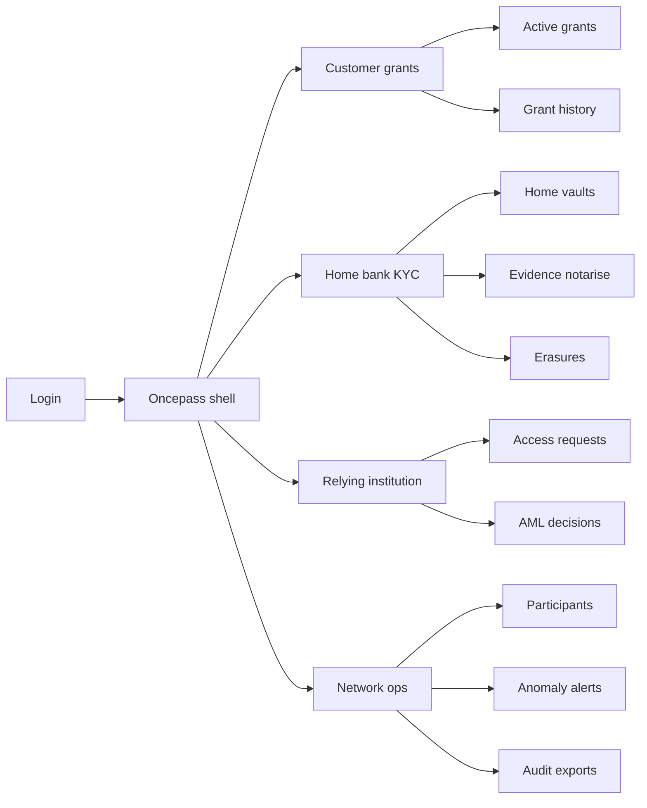
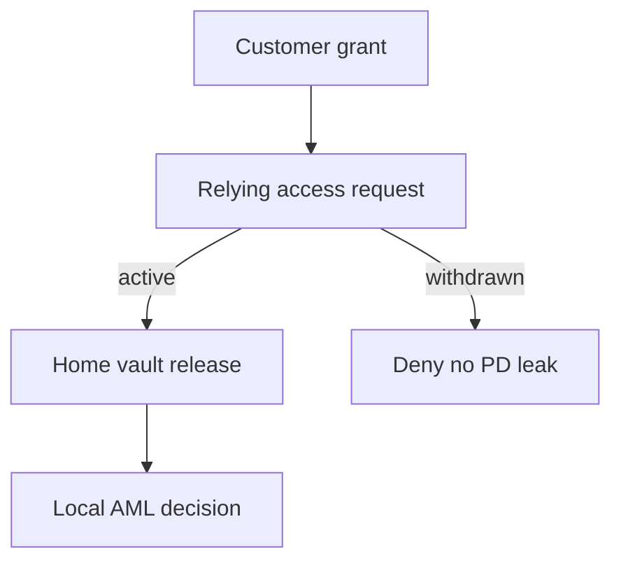

# Oncepass — Web app

**Product:** [PRODUCT.md](./PRODUCT.md)
**Primary surface:** Dual-sided KYC reuse console (Customer grant console + Institution ops under one Oncepass shell)
**Secondary surfaces:** Auditor evidence export viewer (read-only); public PD-never-on-chain attestation page
**Design thesis:** Oncepass is a consent desk for identity evidence — not a CRM and not a blockchain explorer. The UI metaphor is a passport control counter: the home vault holds the documents; the shared plane shows only hash stubs and timed stamps; the customer’s grant list is the boarding pass they can tear up. Visual language is cool bank-steel and seal-indigo on a deep navy ground: active grants feel provisional (amber countdown); withdrawn and erased states feel sealed shut. The Oncepass wordmark sits as a quiet mint-of-authority on every consent-bearing screen so customers know whose revocation they are trusting.

## UX research synthesis

### Category peers (best-in-class)

- **OneTrust Preference / Consent Management:** Purpose-bound consent records, withdrawal that actually stops processing, exportable lawful-basis artefacts. Steal: grant purpose as a first-class field and instant revoke as the loudest customer action — not buried in settings.
- **Yoti / Veriff institutional portals:** Document verification status without shipping raw images into every partner UI. Steal: evidence “pass/fail + reference” panes for relying parties; reject full-image galleries as the default view.
- **Trulioo Globalkyc / Onfido Studio:** Case workflows where AML judgment stays with the institution. Steal: “your decision required” gate after evidence pull; reject shared “network-approved customer” badges that outsource regulated judgment.
- **Sovrin / Hyperledger Indy wallet demos:** SSI presentation without PD on ledger. Steal: optional credential mode that mirrors permissioned grant UX with the same PD ban chrome.

### Patterns to adopt / reject

- **Adopt:** Customer grant console as co-equal surface; hash-only ledger rows with PD-ban seal; time-box + purpose on every grant; withdraw propagates as a blocking banner on relying-party access; AML decision recorded locally after evidence; erasure orphaning as a visible unlink event; anomaly suspension for relying parties.
- **Reject:** Blockchain tx explorers as home; full KYC document browsers for every network participant; permanent “approved by network” status; purple “AI identity score”; consent checkboxes without purpose or expiry; editable access logs.

### Trust, density, and workflow constraints from PRODUCT.md

Customers must see who holds active grants and revoke in one place (BR-7); institutions must never receive document images after failed/expired grants (BR-9). Ledger density is finance/compliance-grade but columns are hash, purpose, and timestamps — never passport fields (BR-2). DPOs need controllership clarity and one-business-day exports (BR-8, BR-10). Relying parties record their own AML decision (BR-4); Oncepass is evidence access, not outsourced judgment. Erasure orphans hashes without pretending the chain was deleted (BR-5).

## Information architecture

### Nav model

### Roles → default home

| Role | Default home | Why |
|------|--------------|-----|
| Customer | Active grants | Revoke and visibility (BR-7) |
| Home bank KYC analyst | Evidence notarise | Issue hashes without PD on chain (BR-2) |
| Relying onboarding officer | Access requests | Pull under active grant (BR-1) |
| MLRO delegate | AML decisions | Local regulated judgment (BR-4) |
| DPO / auditor | Audit exports | Lawful basis artefacts (BR-8) |
| Network operator | Anomaly alerts | Suspend abusive relying parties (BR-12) |

### Cross-links to OpenAPI resources

| Nav area | OpenAPI tags / resources |
|----------|---------------------------|
| Home vaults | Vaults |
| Evidence notarise | Evidence |
| Active grants / withdraw | Consents |
| Access requests | Access |
| Erasures | Erasures |
| Participants / anomalies | Participants |

## Screen inventory

### Customer grant console (home)

- **Purpose:** Answer “who can request my KYC evidence right now?” and revoke instantly.
- **Entry:** Customer login default; deep link from institution consent request.
- **Layout regions:** Brand + subject identity (minimal); active grants list (institution, purpose, countdown); revoke CTA per row; history of withdrawn/expired; PD-never-on-chain seal.
- **Primary actions:** Approve pending grant request; withdraw grant; view purpose detail.
- **Empty / loading / error:** Empty = “no active shares — you control reuse”; loading = skeleton rows; error = retry with request id.
- **BR / story ties:** BR-1, BR-3, BR-7; customer stories.

### Consent grant request (customer)

- **Purpose:** Make purpose, time box, and relying party unambiguous before share.
- **Entry:** Deep link / QR from relying institution onboarding.
- **Layout regions:** Relying party card; purpose statement; expiry picker; what is shared (evidence reference only — not documents); confirm / deny.
- **Primary actions:** Grant; deny; ask for more purpose detail.
- **Empty / loading / error:** Invalid request = expired link banner; deny leaves no access trail of documents.
- **BR / story ties:** BR-1, BR-3, BR-9.

### Home vault register

- **Purpose:** Bind institution-held identity attributes off-chain as the source of truth for reuse.
- **Entry:** Home bank KYC nav → Vaults.
- **Layout regions:** Vault list; subject ref (opaque); attribute completeness without rendering PD; integration status to incumbent KYC case manager.
- **Primary actions:** Register vault; refresh completeness; open notarise.
- **Empty / loading / error:** Empty = connect first CDM/KYC vendor; sync error = blocking banner.
- **BR / story ties:** BR-1; change-management federation.

### Evidence notarise

- **Purpose:** Write cryptographic evidence / hash to shared ledger without personal data.
- **Entry:** From vault or Evidence nav.
- **Layout regions:** Subject/vault picker; hash preview; PD-ban checklist (must pass); ledger receipt; audit note field.
- **Primary actions:** Notarise; copy evidence id; open related grants.
- **Empty / loading / error:** PD-ban fail blocks submit; loading = hashing progress.
- **BR / story ties:** BR-2, BR-6.

### Relying access queue

- **Purpose:** Request and receive verification evidence only under an active, purpose-matching grant.
- **Entry:** Relying institution default.
- **Layout regions:** Queue (pending / allowed / denied); grant status chip; short-lived payload ref panel (no image dump); deny reasons (expired, withdrawn, purpose mismatch).
- **Primary actions:** Request access; open payload; jump to AML decision form.
- **Empty / loading / error:** No grant = “ask customer to approve”; expired = no leak of images (BR-9).
- **BR / story ties:** BR-1, BR-3, BR-9.

### AML decision (relying)

- **Purpose:** Force local AML judgment after evidence — network never stamps “approved customer.”
- **Entry:** After successful access; MLRO queue.
- **Layout regions:** Evidence summary (hash + checks); decision form; escalation path; retention note.
- **Primary actions:** Record approve/refer/reject; export case stub to AML manager.
- **Empty / loading / error:** Missing evidence blocks decision; validation on required fields.
- **BR / story ties:** BR-4.

### Erasure and orphaning

- **Purpose:** Delete vault PD and orphan on-chain hashes without claiming ledger deletion.
- **Entry:** Home KYC → Erasures; DPO request.
- **Layout regions:** Subject search; vault delete confirm; orphan event log (hash unlink); attestation that PD was never on ledger.
- **Primary actions:** Execute erasure; generate auditor pack.
- **Empty / loading / error:** Already orphaned = sealed state; partial fail = coral banner with runbook.
- **BR / story ties:** BR-5; auditor stories.

### Participant and controllership

- **Purpose:** Record which legal entity is controller/processor for shared components.
- **Entry:** Network ops → Participants.
- **Layout regions:** Org table; Article 26/28 role tags; onboarding checklist; suspension status.
- **Primary actions:** Onboard org; set roles; suspend.
- **Empty / loading / error:** Missing controllership = cannot go live (BR-10).
- **BR / story ties:** BR-10.

### Anomaly alerts

- **Purpose:** Surface abnormal relying-party access patterns and contain breach risk.
- **Entry:** Network ops default for operators.
- **Layout regions:** Alert queue; access volume charts; suspend / investigate controls; breach-notification hook status.
- **Primary actions:** Suspend participant; notify DPO; clear false positive with reason.
- **Empty / loading / error:** Empty = healthy network message.
- **BR / story ties:** BR-12.

### Audit exports

- **Purpose:** Deliver consent and access artefacts within one business day.
- **Entry:** DPO / auditor home.
- **Layout regions:** Date/org filters; export job list; PD-never-on-chain attestation; controllership appendix.
- **Primary actions:** Request export; download; share secure link.
- **Empty / loading / error:** Job failed = retry + support id.
- **BR / story ties:** BR-8.

### Reuse metrics

- **Purpose:** Show grant→completed onboarding conversion without counting abandoned flows as success.
- **Entry:** Home bank / network ops reporting.
- **Layout regions:** Funnel (grant → access → AML decision → onboarded); cost-per-reuse estimate; abandon reasons.
- **Primary actions:** Export cycle report; filter by relying party.
- **Empty / loading / error:** Insufficient volume = “collecting baseline.”
- **BR / story ties:** BR-11.

### Optional SSI mode settings

- **Purpose:** Enable public-network credential presentations under the same PD ban.
- **Entry:** Network ops / home vault advanced.
- **Layout regions:** Mode toggle; credential template; PD-ban enforcement status identical to permissioned.
- **Primary actions:** Enable SSI template; test presentation; disable.
- **Empty / loading / error:** PD-ban violation blocks enable.
- **BR / story ties:** BR-6.

## Key flows

1. **Consent-gated reuse** — customer grants purpose/time box → relying requests access → home vault releases proof off-chain → AML decision local; failure: withdrawn/expired blocks payload (BR-9).

2. **Notarise without PD** — vault complete → PD-ban checklist → hash to ledger → receipt; failure: checklist fail blocks write (BR-2).

3. **Instant withdraw** — customer revokes → grant state withdrawn → in-flight access denied → relying UI shows revoke banner (BR-3, BR-7).

4. **Erasure orphan** — DPO/home executes vault delete → orphan event unlinks hashes → auditor attestation pack (BR-5).

5. **Anomaly suspend** — alert fires → operator suspends relying party → breach hooks notify → access blocked network-wide (BR-12).

## Design system

### Tokens (CSS variables)

- `--color-ink: #E6EEF5` — primary text
- `--color-navy-950: #0A1220` — app ground
- `--color-navy-900: #121C2E` — panels
- `--color-steel: #7A93A8` — secondary labels
- `--color-seal: #4C6FFF` — active grant / authority accent (seal-indigo, not purple-glow marketing)
- `--color-seal-dim: #2A3D8F` — seal on dark
- `--color-amber: #E0A12B` — grant countdown / provisional
- `--color-coral: #E85D4C` — withdraw block / anomaly
- `--color-mint: #3DDC97` — PD-ban pass / orphan sealed
- `--color-brand: #A8C0FF` — Oncepass wordmark
- `--font-display: "Source Serif 4", serif` — grant titles and customer-facing authority
- `--font-body: "IBM Plex Sans", sans-serif` — console
- `--font-mono: "IBM Plex Mono", monospace` — hashes, grant ids
- `--space-1`…`--space-8`: 4px scale
- `--radius-sm: 4px`; `--radius-md: 8px`
- `--motion-revoke: 200ms ease-out` — grant row seals shut
- `--motion-countdown: 1s linear` — amber expiry pulse
- Atmosphere: soft vertical “counter glass” vignette; faint hash-grid watermark on ledger panes; no stock passport photos in console.

### Typography & brand

- Serif display for customer grant headlines; mono for evidence hashes; sans for ops tables.
- Brand wordmark left of chrome on every consent and money-of-trust screen; customer home title never outranks “Oncepass.”
- Login shell: brand hero, one line (“Share KYC evidence once — revoke anytime”), one CTA.

### Do / don’t

- **Do:** Show purpose + expiry on every grant; treat withdrawn as settlement-blocking for access; prove PD-ban with seal + attestation; keep AML decision on relying side.
- **Don’t:** Purple AI glow; full document image walls for network peers; explorers as home; permanent network-approved badges; pill spam for every filter.

### Accessibility & domain trust cues

- AA+ contrast on seal/amber/coral vs navy; revoke never colour-only — text “Withdrawn” + lock.
- Live regions announce grant expiry and anomaly suspensions.
- Focus order customer: pending request → purpose → confirm → active list → revoke.
- Auditor page exposes machine-readable “no PD on ledger” attestation.

## Component patterns

- **ConsentGrantRow** — purpose, time box, withdraw, status (active / withdrawn / expired).
- **PdBanSeal** — checklist + pass/fail before notarise.
- **EvidenceHashStub** — mono hash with copy; never expands to PD.
- **AccessDenyBanner** — withdrawn/expired with no payload affordance.
- **AmlDecisionGate** — required local judgment after access.
- **OrphanEventLog** — erasure unlink timeline.
- **ControllershipTag** — controller/processor on participant.
- **AnomalySuspendControl** — network containment action.

## Out of scope for v1 web

- Full bank KYC case-manager replacement; consumer marketing site beyond login; mobile-native wallet app (API/deep links only); public blockchain explorer; biometric capture studio; multi-country eID broker beyond optional SSI hook.
